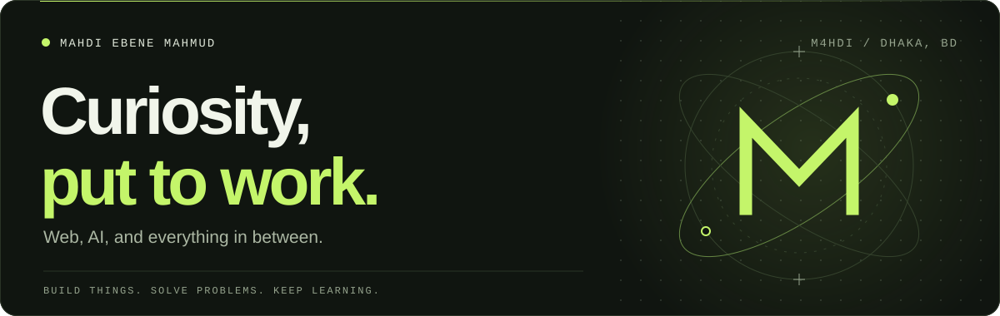
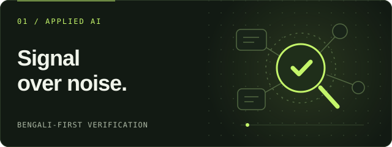
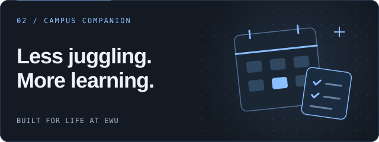
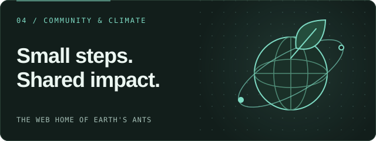

  

  <samp>
    <a href="https://m4hdi.codes">PORTFOLIO</a> &nbsp;/&nbsp;
    <a href="https://codeforces.com/profile/M4hdl">CODEFORCES</a> &nbsp;/&nbsp;
    <a href="https://www.linkedin.com/in/m4hdi">LINKEDIN</a> &nbsp;/&nbsp;
    <a href="mailto:worksformahdi@gmail.com">SAY&nbsp;HELLO</a>
  </samp>

# Hey, I'm Mahdi

I'm **Mahdi Ebene Mahmud**, a **Computer Science & Engineering student at East West University**, based in **Dhaka, Bangladesh**. I enjoy building web interfaces and working through programming problems—not just getting something to run, but understanding how it works.

This is where I share what I'm building and learning: frontend experiments, useful tools, and the occasional idea that grows into an app.

## Right now

- **Exploring:** AI agents and automation, with hands-on projects to learn from.
- **Learning:** C++ and strengthening my problem-solving skills.
- **Looking for:** open-source projects where I can contribute and learn.
- **Happy to talk about:** web development, campus tools, and competitive programming.

## Languages & tools

**Frontend:** `HTML` `CSS` `JavaScript` `TypeScript` `React` `Next.js` `Astro` `Tailwind CSS`

**Mobile:** `Flutter` `Dart` `Hive`

**Backend & AI projects:** `Python` `FastAPI` `Node.js` `Express` `Supabase` `Redis`

**Programming & everyday tools:** `C` `C++` `Java` `Git` `VS Code` `Vite`

## Competitive programming

You'll find me on **[Codeforces as M4hdl](https://codeforces.com/profile/M4hdl)**. I'm practicing with **C++**, building my understanding of algorithms, and getting better at breaking problems down.

Want to practice for a contest or compare approaches to a problem? I'm up for it.

## GitHub activity

  

  <a href="https://github.com/mahdiebene?tab=overview">Contributions</a> &nbsp;·&nbsp;
  <a href="https://github.com/mahdiebene?tab=repositories">Repositories</a>

## Selected projects

  
  

  
  

- **[TrustLensAI](https://github.com/mahdiebene/TrustLensAI)** — Bengali-first claim verification with explainable trust scores. [Try it](https://www.trustlensai.tech/)
- **[EWU Toolbox](https://github.com/mahdiebene/EWU-ToolBox)** — An offline-first academic companion for EWU students. [Project page](https://m4hdi.codes/projects/ba72d9eb-8b7a-4790-8a3e-45d88ce5e1a2)
- **[Ani-Gadgets](https://github.com/mahdiebene/Ani-Gadgets)** — Anime merchandise discovery for fans in Bangladesh. [Explore](https://www.anigadgetsbd.app/)
- **[Project Earth](https://github.com/m4hdiebene/Project-Earth)** *(fork)* — A web home for the environmental organization Earth's Ants. [Visit site](https://www.earthsants.org/)

## Let's connect

Open-source contributions, creative builds, or contest practice—I'd love to collaborate. You can reach me by **[email](mailto:worksformahdi@gmail.com)** or **[LinkedIn](https://www.linkedin.com/in/m4hdi)**, and find more about me at **[m4hdi.codes](https://m4hdi.codes)**.

---

  Forever Yorozuya. Always learning.

